## Promises with Generics using TypeScript

--- 

# Who am I?

Brennan Stehling

Long time JavaScript Developer

JavaScript ➤ AJAX ➤ Node.js ➤ TypeScript 

---

## Summary

* Why use Promises?
* What are Generics?
* What is TypeScript?
* Which IDE can I use?
* How can I automated this transpiling?
* How can I ensure my coding standards?

---

## Why use Promises?

* Introduced with  ES6
* Callback Hell
* Function Chaining
* Cleaner Syntax

---

## What are Generics?

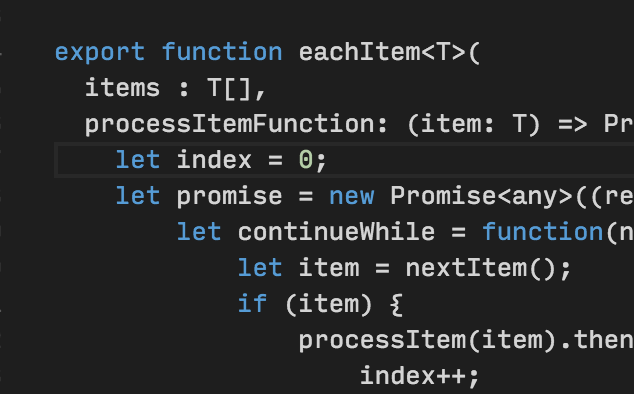

---

## What is TypeScript?

* Superset of JavaScript
* Includes Promises & Generics
* ES5 and ES6 compatible
* TS is transpiled to JS
* Visit typescriptlang.org

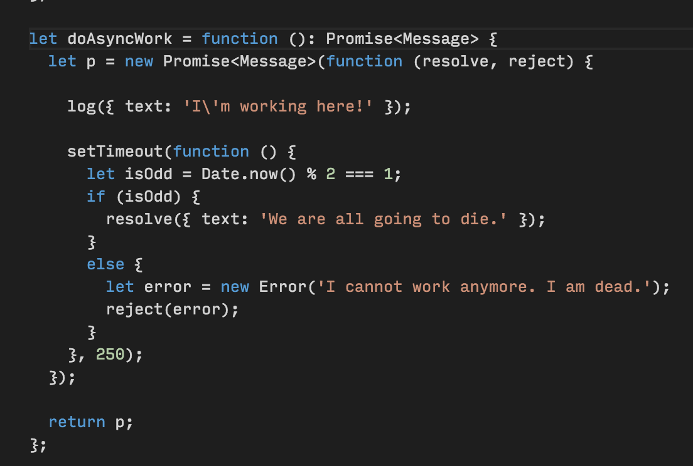

---

## Created by Anders Hejlsberg

* Delphi
* C#
* TypeScript

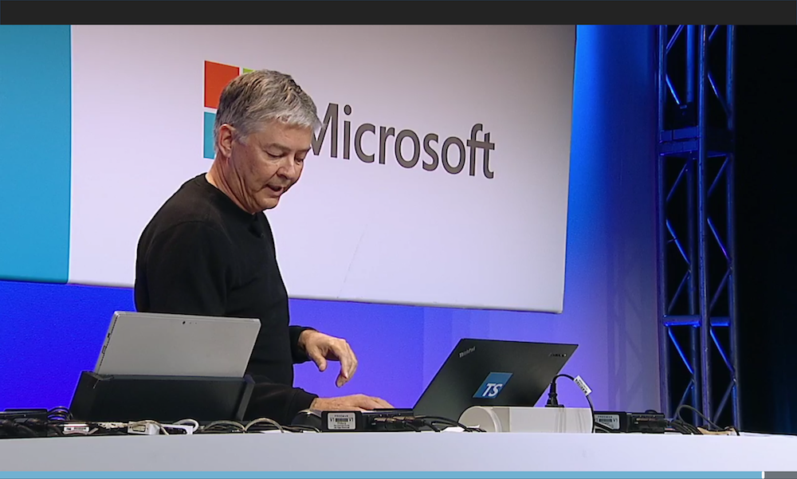

---

## Which IDE can I use?

 * VSCode (now v1.4.0)
 * Built on Atom/Electron
 * Helpful IDE features
 * Extensions Gallery
 * Task manager integration
 * Visit code.visualstudio.com

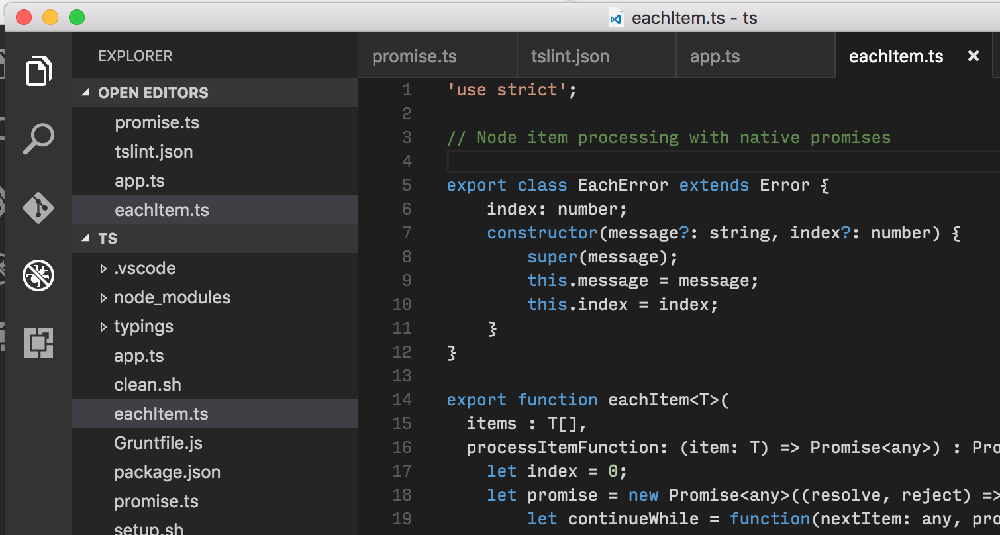

---

## Type and Syntax Support

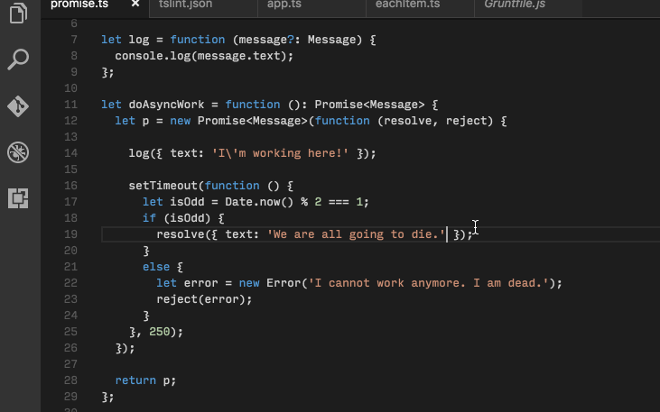

---

## Good but not perfect 🤓

* Submit bugs as issues on GitHub
* Comment on current issues
* Provide details when you can
* The team is very responsive
* Updates are regular

---

## Extensions for VSCode

* Install extensions easily
* Stay up to date
* Create your own extensions
* See Extension Gallery

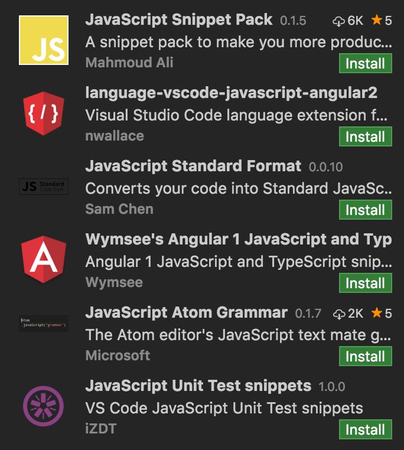 

---

## Highly Configurable

* .vscode/launch.json
* .vscode/settings.json
* .vscode/tasks.json

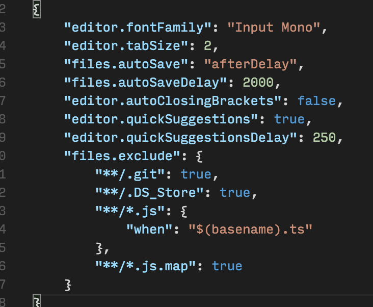

---

## Hiding Javscript

* Show TypeScript
* Hide JavaScript

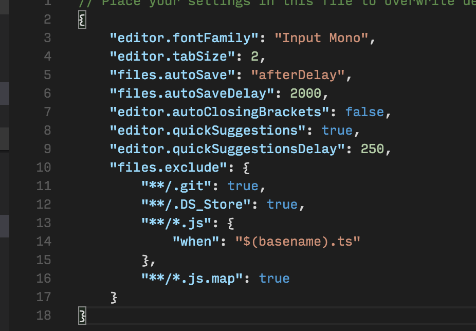

---

## Debugging TypeScript

* Set Breakpoints in TS
* Use SourceMaps

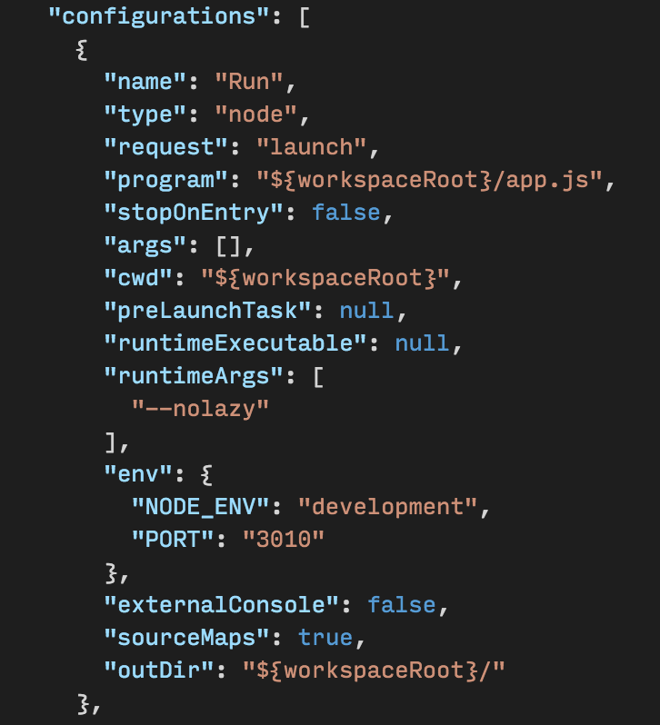

---

# DEMO!

---

---

## How can I automated this transpiling?

* Watch `tsc -w`
* Grunt or Gulp
* Configure Tasks in VSCode

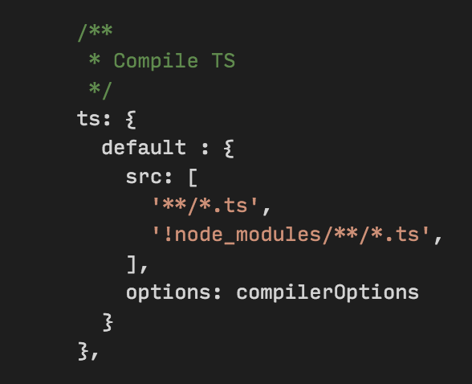

---

## How can I ensure my coding standards?

* tslint.json
* Like jslint/jshint

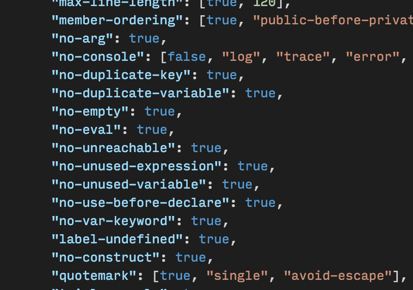

--- 

## Thank you!

---

# Questions?

### Brennan Stehling
#### @brennansv
#### github.com/brennanMKE
#### gist.github.com/brennanMKE

